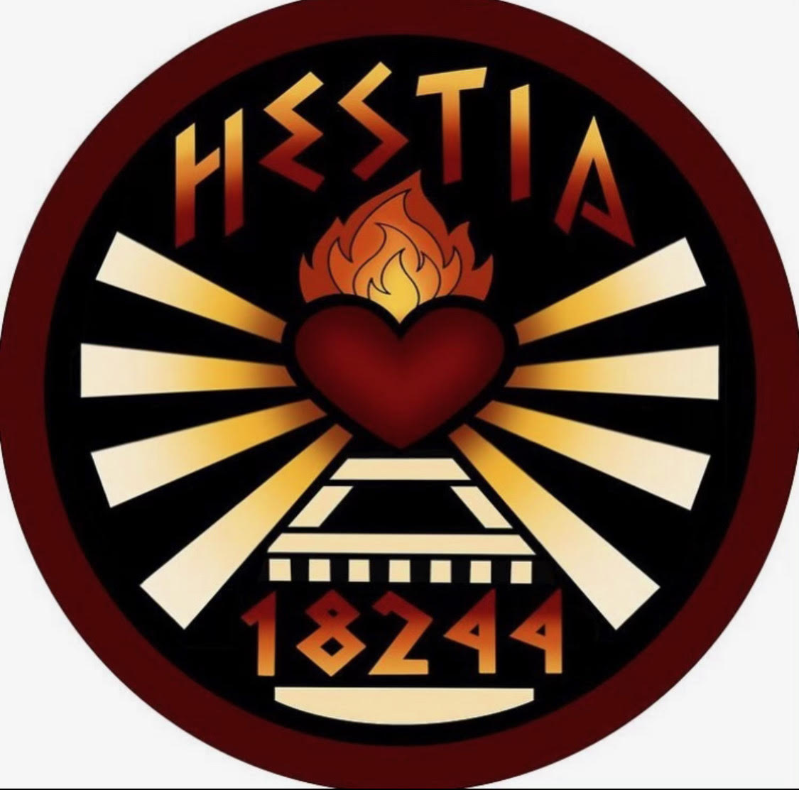

# Hestia's Repository for FTC PowerPlay 2022-2023

## Welcome!

This repository contains all of the programs we used for FTC's PowerPlay game. For other teams out there, feel free to use this repository as a reference.

## Navigating This Repository

This repository has all of the elements of the official [FTC SDK](https://github.com/FIRST-Tech-Challenge/FtcRobotController) as well as our team's specific programs.

For those who may not know where to find all of our code, start by looking in the `TeamCode` directory, then click the `src/main` repository, and then finally click the `java/org/firstinspires/ftc/teamcode`, which will lead you to the `teamcode` module where all of our code is stored.

### Directories within the `teamcode` module

Within the `teamcode` module, there are three separate directories:

1. `TeleOp` is where we store all of our code for the driver operated part of the game. `RobotTwoTeleOp.java` is the current program we use for our current robot, but we also have two other programs that were used for a previous robot.

1. `OpenCvAutonomous` is where we store our code for the autonomous part of the game. In this directory, you will find the pipeline that is used for our camera to be able to recognize the April Tags, as well as the two programs we use for autonomous based on which side we are on.

1. `Autonomous` is where we store all of our code that we used for a simple autonomous. The autonomous programs within that directory are programs that simply make our robot park in the terminals. We don't use those modes as of recent, but we do keep them as a back up in case the programs in the `OpenCvAutonomous` directory fail.

Within these directories, you will also find a README file that describes the code in a bit more detail.

## Additional Links

Thank you so much for checking out our repository! If you want to check out our [website](https://hestia18244.carrd.co/) or our [instagram](https://www.instagram.com/hestia18244/), we would greatly appreciate it!